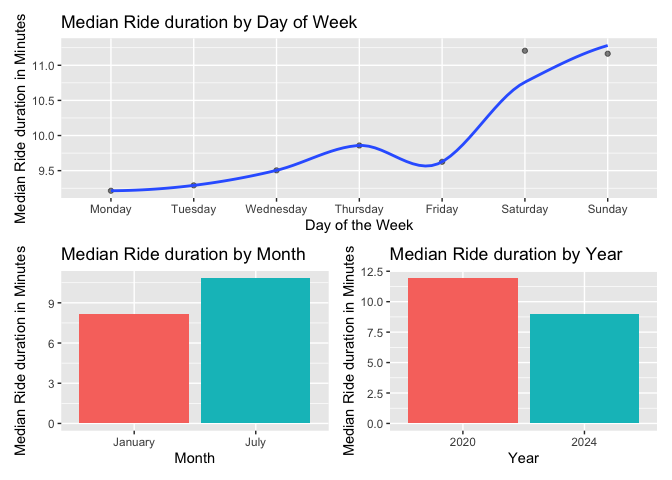

DataScience_HW3
================
2024-10-10

## Problem 1

Size of dataset before data cleaning: 7 variables (columns) and 2595176
observations (rows).

Variable names include: id, date, prcp, snow, snwd, tmax, tmin.

There is a significant amount of missing data

``` r
filter(ny_noaa, (is.na(snow) | snow == "") &
         (is.na(tmin) | tmin == "") &
         (is.na(tmax) | tmax == "") &
         (is.na(prcp) | prcp == "")) %>% 
  nrow()
```

    ## [1] 73950

There are 73950 rows that have missing data in all four columns tmax,
tmin, prcp, and snow.

``` r
filter(ny_noaa, (is.na(tmin) | tmin == "") &
         (is.na(tmax) | tmax == "")) %>% 
  nrow()
```

    ## [1] 1132502

And 1132502 rows that have missing data for both coloumns tmax and tmin.

The missing data is an issue, as there is inconsistancy in the data /
information.

**Do some data cleaning. Create separate variables for year, month, and
day.**

``` r
dated_ny_noaa = 
  ny_noaa %>% 
  mutate(
    year = year(date),
    month = month(date),
    day = day(date)
  ) %>% 
  select(-date)
```

**Ensure observations for temperature, precipitation, and snowfall are
given in reasonable units.**

Current units –\>

- temperature in 10ths of degrees celcius (need to be converted to whole
  degrees celcius)

- precipitation in tenths of mm (to be converted to mm)

- snowfall in mm (can remain in mm or converted to cm)

``` r
dated_ny_noaa = 
  dated_ny_noaa %>% 
  mutate(tmax = as.integer(tmax), 
         tmin = as.integer(tmin)) %>% 
  mutate(tmax = tmax / 10, 
         tmin = tmin / 10, 
         prcp = prcp / 10)
```

**For snowfall, what are the most commonly observed values? Why?**

``` r
dated_ny_noaa %>% 
  filter(snow > 0) %>%
  group_by(snow) %>% 
  summarise(count = n()) %>% 
  arrange(desc(count)) %>%
  slice_head(n = 5) %>%
  pull(snow)              
```

    ## [1] 25 13 51 76  8

Most commonly observed value was 0 snowfall, followed by 25, 13, 51 and
76mm of snow fall.

This is consistent with the fact that it only snows in the coldest
months of winter in NY therefore majority of the observations will have
0 snow. It is also noted that on average, NYC sees around 29.8 inches of
snow in a season which is relatively consistent with the most commonly
observed values of snowfall in this data frame.

**Make a two-panel plot showing the average max temperature in January
and in July in each station across years. Is there any observable /
interpretable structure? Any outliers?**

``` r
avg_tmax_1 = 
dated_ny_noaa %>% 
  filter(month == 1) %>% 
  group_by(id, year, month) %>% 
  summarise(mean_value = mean(tmax, na.rm = TRUE)) %>% 
  filter(!is.na(mean_value))
```

    ## `summarise()` has grouped output by 'id', 'year'. You can override using the
    ## `.groups` argument.

``` r
avg_tmax_7 = 
dated_ny_noaa %>% 
  filter(month == 7) %>% 
  group_by(id, year, month) %>% 
  summarise(mean_value = mean(tmax, na.rm = TRUE)) %>% 
  filter(!is.na(mean_value))
```

    ## `summarise()` has grouped output by 'id', 'year'. You can override using the
    ## `.groups` argument.

``` r
tmax_1_p = 
  avg_tmax_1 %>% 
  ggplot(aes(x = year, y = mean_value, color = id)) +
  geom_point(alpha = .5) +
  labs(title = "Average Maximum Temperature of Stations in January across Years and Stations",
       x = "Year",  
       y = "Average Maximum Temperature (°C)") + 
  theme(legend.position = "none")

tmax_7_p = 
  avg_tmax_7 %>% 
  ggplot(aes(x = year, y = mean_value, color = id)) +
  geom_point(alpha = .5) +
  labs(title = "Average Maximum Temperature of Stations in July across Years and Stations",
       x = "Year",  
       y = "Average Maximum Temperature (°C)") + 
  theme(legend.position = "none")

tmax_1_p + tmax_7_p
```

<!-- -->

In general the average maximum temperatures in January are more varied
across the years and spread out within the year then those in July.

There may be a slight upward trend of the average maximum temperature in
January as the years pass, but this is only very slight and would need
to be further confirmed.

Some noticeable outliers include in the year 1981 January where there
was an extremely low temperature recording average of about -17 degrees
Celsius. Where the other stations recorded around the 2 to -7 degrees
Celsius range. Similarly in January 2005, one station recorded a low of
-14 degree Celsius where the other stations in that same time averaged
around 5 to -5 degrees Celsius.

One outlier of Average Maximum Temperature in July is 1988 where one
station averaged below 15 degrees Celsius, where other stations in that
month had average recordings around 25 to 30 degrees Celsius.

**Make a two-panel plot showing (i) tmax vs tmin for the full dataset
(note that a scatterplot may not be the best option);**

**(ii) make a plot showing the distribution of snowfall values greater
than 0 and less than 100 separately by year.**

## Problem 2

**Load, tidy, merge, and otherwise organize the data sets. Your final
dataset should include all originally observed variables; exclude
participants less than 21 years of age, and those with missing
demographic data; and encode data with reasonable variable classes
(i.e. not numeric, and using factors with the ordering of tables and
plots in mind).**

``` r
demographic_df = 
  read_csv(file = "data/nhanes_covar.csv", 
           na = c("NA", ",", ".")) %>% 
  janitor::clean_names()
```

    ## New names:
    ## Rows: 254 Columns: 5
    ## ── Column specification
    ## ──────────────────────────────────────────────────────── Delimiter: "," chr
    ## (5): ...1, 1 = male, ...3, ...4, 1 = Less than high school
    ## ℹ Use `spec()` to retrieve the full column specification for this data. ℹ
    ## Specify the column types or set `show_col_types = FALSE` to quiet this message.
    ## • `` -> `...1`
    ## • `` -> `...3`
    ## • `` -> `...4`

``` r
accelerometer_df = 
  read_csv(file = "data/nhanes_accel.csv", 
           na = c("NA", ",", ".")) %>% 
  janitor::clean_names()
```

    ## Rows: 250 Columns: 1441
    ## ── Column specification ────────────────────────────────────────────────────────
    ## Delimiter: ","
    ## dbl (1441): SEQN, min1, min2, min3, min4, min5, min6, min7, min8, min9, min1...
    ## 
    ## ℹ Use `spec()` to retrieve the full column specification for this data.
    ## ℹ Specify the column types or set `show_col_types = FALSE` to quiet this message.

``` r
demographic_df = 
  demographic_df %>% 
  { 
    colnames(.) <- as.character(.[4, ])
    .[-4, ]
  } %>% 
  slice(-1,-2,-3) %>% 
  mutate(
    age = as.numeric(age),
    BMI = as.numeric(BMI),
    sex = 
      case_match(
        sex, 
        "1" ~ "male", 
        "2" ~ "female"),
    sex = as.factor(sex),
    education = 
      case_match(
        education, 
        "1" ~ "less_than_high_school",
        "2" ~ "high_school_equivalent",
        "3" ~ "more_than_high_school"), 
    education = as.factor(education)
  ) %>% 
  filter(age > 20) %>% 
  drop_na() %>% 
  rename(seqn = SEQN)
```

``` r
accelerometer_df =
  accelerometer_df %>%
  pivot_longer(
    cols = starts_with("min"),
    names_to = "minute", 
    names_prefix = "min",
    values_to = "MIMS_values" 
  ) %>% 
  mutate(
    seqn = as.character(seqn)
  )
```

``` r
Demo_Acc_Join_df =
  left_join(demographic_df, accelerometer_df, by = "seqn")
```

**Produce a reader-friendly table for the number of men and women in
each education category, and create a visualization of the age
distributions for men and women in each education category. Comment on
these items.**

``` r
Sex_Edu_df =
  Demo_Acc_Join_df %>% 
  group_by(education, sex) %>%
  summarise(count = n(), .groups = 'drop') %>%
  pivot_wider(
    names_from = sex, 
    values_from = count)
  
kable(Sex_Edu_df, caption = "Number of Participants by Education and Sex")
```

| education              | female |  male |
|:-----------------------|-------:|------:|
| high_school_equivalent |  33120 | 50400 |
| less_than_high_school  |  40320 | 38880 |
| more_than_high_school  |  84960 | 80640 |

Number of Participants by Education and Sex

``` r
Sex_Edu_df %>% 
  pivot_longer(
    cols = female:male, 
    names_to = "sex", 
    values_to = "count") %>% 
  mutate(
    education = factor(education, levels = c("less_than_high_school", "high_school_equivalent", "more_than_high_school"))
  ) %>% 
  ggplot(aes(x = education, y = count, fill = sex)) + 
  geom_bar(stat = "identity", position = "dodge") +
  labs(title = "Number of participants by Education level and Sex",
       x = "Education",
       y = "Number of participants",
       fill = "Sex") +
  theme_minimal()
```

<!-- -->

``` r
Demo_Acc_Join_df %>% 
  group_by(education, sex) %>% 
  mutate(
    education = factor(education, levels = c("less_than_high_school", "high_school_equivalent", "more_than_high_school"))
  ) %>% 
  ggplot(aes(x = education, y = age, fill = sex)) +
  geom_boxplot()
```

<!-- -->

In general there are a significantly greater number of participants in
this study that have a ‘more than high school’ education level (~ 80000
for both females and males, whereas the other two education levels hover
around the 40000 mark). The number of females and males are relatively
similar for those categorised in ‘more tan high school’ and ‘less than
high school’ education level. There are however more males (~ 50000)
than females (~ 35000) which are high school students in this study.
Overall, there are more males than females in this study.

In the ‘more than high school’ and ‘less than high school’ education
levels the age distribution for the males and females are similar within
their respective education levels. They share similar ranges, similar
interquartile ranges and medians. In the ‘high school equivalent’
education level the females have a older age distribution, with a high
median around 60, compared to the males at 50. While the interquartile
ranges still overlap, the females are pulled older from ~45 to ~75 years
old, where the males interquartile range covers ~30 to ~65 years old.

Those males and females of the ‘more than high school’ education level
have a younger age distribution (indicated by the median around 40 years
old) than those from a ‘less than high school’ (60) or ‘high school
equivalent’ (~55-60) education level.

**Traditional analyses of accelerometer data focus on the total activity
over the day. Using your tidied dataset, aggregate across minutes to
create a total activity variable for each participant. Plot these total
activities (y-axis) against age (x-axis); your plot should compare men
to women and have separate panels for each education level. Include a
trend line or a smooth to illustrate differences. Comment on your
plot.**

``` r
Daily_act_df = 
  Demo_Acc_Join_df %>% 
  group_by(seqn) %>% 
  mutate(
    daily_activity = 
      sum(MIMS_values, na.rm = TRUE)) %>% 
  ungroup()
```

``` r
daily_act_edu_sex_p = 
  Daily_act_df %>% 
  mutate(
    education = factor(education, levels = c("less_than_high_school", "high_school_equivalent", "more_than_high_school"))
  ) %>% 
  ggplot(aes(x = age, y = daily_activity, color = sex)) + 
  geom_point(alpha = .5) + 
  geom_smooth(aes(group = sex), se = FALSE) + 
  facet_grid(. ~ education) + 
  theme_minimal()

print(daily_act_edu_sex_p)
```

    ## `geom_smooth()` using method = 'gam' and formula = 'y ~ s(x, bs = "cs")'

<!-- -->

There seems to be a general downward trend where as the participant gets
older their total daily activity decreases too.

Those participants in the ‘more than high school’ education level have
the most consistent total daily activity across the ages. Whereas those
in the ‘less than high school’ education level show an obvious decrease
in daily activity from 20 to 80 years olds.

There is an interesting pattern for all three education levels, where
around the 60 year old mark there are either prominent peaks or dips in
daily total activity that does not follow the general trend. For
instance in the ‘high school equivalent’ education level, around 60
years of both males and females participants have a sharp dip in total
daily activity. But in the ‘less than high school’ education level group
at around 60 years the females show a sudden drop and the males a peak
in total daily activity. This is the opposite for participants in the
‘more than high school’ education, males dipping and females peaking at
around 60 years.

**Accelerometer data allows the inspection activity over the course of
the day. Make a three-panel plot that shows the 24-hour activity time
courses for each education level and use color to indicate sex. Describe
in words any patterns or conclusions you can make based on this graph;
including smooth trends may help identify differences.**

``` r
Daily_act_df %>% 
  mutate(
    education = factor(education, levels = c("less_than_high_school", "high_school_equivalent", "more_than_high_school"))
  ) %>% 
  mutate(
    minute = as.numeric(minute)
  ) %>% 
  mutate(
    hour = ceiling(minute / 60)) %>% 
  ggplot(aes(x = hour, y = MIMS_values, color = sex)) + 
  geom_point(alpha = .5) + 
  geom_smooth(aes(group = sex), se = FALSE) + 
  facet_grid(. ~ education) + 
  theme_minimal()
```

    ## `geom_smooth()` using method = 'gam' and formula = 'y ~ s(x, bs = "cs")'

<!-- -->

See that in across all three education levels there is a general rise
and fall of activity as the hours pass in the day. This is consistent
with potential sleep/wake schedules. Where from the 1st hour to
approximately the 7th hour of the day all individuals are at low
activity. After that, throughout the day, there is relatively consistent
activity across the sexes (denoted by the smooth trend). Activity is on
a decrease again at the 21st hour which is consistent with potential end
of the day.

At each hour there is a spread of activity based on individual which is
consistent with the idea that each individual has their unique life.
However, we can notice that the spread / variance of the activity is
smallest at the first few hours of the day (furthering consistent with
the idea that this could be the times of sleep), and the greatest
variance around the 10th and 19th hour (if this is based on the normal
24hr clock this makes sense as when people are usually most active,
either starting or ending their day. Whereas in the middle of the day
they could be more stationary at a day job).

In the ‘less than high school’ and ‘high school equivalent’ education
levels their activity throughout the day does not exceed 50 MIMS.
However, in the ‘more than high school’ education level there are
participants whose activity reach 75 and even 100 MIMS. My hypothesis is
that these are correspondent to those participants working out,
especially since those peaks occur around supposed morning and evening
times which are the most common times to work out. This encourages
further research into type of demographic which make up each education
level, whether there is a certain dominant lifestyle which could further
explain these activity patterns.

## Problem 3

**Files contain 1% of all rides with a total duration less than 4 hours
in each of four months. Import, clean, and tidy these data, and describe
the resulting dataset.**

``` r
Jan_2020_Citi_df = 
  read_csv("citibike/Jan 2020 Citi.csv.zip", na = c("NA", ".", "")) %>%   janitor::clean_names()%>% 
  mutate(
    weekdays = factor(weekdays, levels = c("Monday", "Tuesday", "Wednesday", "Thursday", "Friday", "Saturday", "Sunday")),
    rideable_type = as.factor(rideable_type),
    member_casual = as.factor(member_casual),
    date = "Jan_2020"
  ) %>% 
  rename(bike_type = rideable_type,
    day_of_week = weekdays,
    ride_duration = duration,
    membership_status = member_casual
  )
```

    ## Rows: 12420 Columns: 7
    ## ── Column specification ────────────────────────────────────────────────────────
    ## Delimiter: ","
    ## chr (6): ride_id, rideable_type, weekdays, start_station_name, end_station_n...
    ## dbl (1): duration
    ## 
    ## ℹ Use `spec()` to retrieve the full column specification for this data.
    ## ℹ Specify the column types or set `show_col_types = FALSE` to quiet this message.

``` r
Jan_2024_Citi_df = 
  read_csv("citibike/Jan 2024 Citi.csv.zip", na = c("NA", ".", "")) %>%   janitor::clean_names()%>% 
  mutate(
    weekdays = factor(weekdays, levels = c("Monday", "Tuesday", "Wednesday", "Thursday", "Friday", "Saturday", "Sunday")),
    rideable_type = as.factor(rideable_type),
    member_casual = as.factor(member_casual),
    date = "Jan_2024"
  ) %>% 
  rename(bike_type = rideable_type,
    day_of_week = weekdays,
    ride_duration = duration,
    membership_status = member_casual
  )
```

    ## Rows: 18861 Columns: 7
    ## ── Column specification ────────────────────────────────────────────────────────
    ## Delimiter: ","
    ## chr (6): ride_id, rideable_type, weekdays, start_station_name, end_station_n...
    ## dbl (1): duration
    ## 
    ## ℹ Use `spec()` to retrieve the full column specification for this data.
    ## ℹ Specify the column types or set `show_col_types = FALSE` to quiet this message.

``` r
Jul_2020_Citi_df = 
  read_csv("citibike/July 2020 Citi.csv.zip", na = c("NA", ".", "")) %>%   janitor::clean_names()%>% 
  mutate(
    weekdays = factor(weekdays, levels = c("Monday", "Tuesday", "Wednesday", "Thursday", "Friday", "Saturday", "Sunday")),
    rideable_type = as.factor(rideable_type),
    member_casual = as.factor(member_casual),
    date = "Jul_2020"
  ) %>% 
  rename(bike_type = rideable_type,
    day_of_week = weekdays,
    ride_duration = duration,
    membership_status = member_casual
  )
```

    ## Rows: 21048 Columns: 7
    ## ── Column specification ────────────────────────────────────────────────────────
    ## Delimiter: ","
    ## chr (6): ride_id, rideable_type, weekdays, start_station_name, end_station_n...
    ## dbl (1): duration
    ## 
    ## ℹ Use `spec()` to retrieve the full column specification for this data.
    ## ℹ Specify the column types or set `show_col_types = FALSE` to quiet this message.

``` r
Jul_2024_Citi_df = 
  read_csv("citibike/July 2024 Citi.csv.zip", na = c("NA", ".", "")) %>%   janitor::clean_names()%>% 
  mutate(
    weekdays = factor(weekdays, levels = c("Monday", "Tuesday", "Wednesday", "Thursday", "Friday", "Saturday", "Sunday")),
    rideable_type = as.factor(rideable_type),
    member_casual = as.factor(member_casual),
    date = "Jul_2024"
  ) %>% 
  rename(bike_type = rideable_type,
    day_of_week = weekdays,
    ride_duration = duration,
    membership_status = member_casual
  )
```

    ## Rows: 47156 Columns: 7
    ## ── Column specification ────────────────────────────────────────────────────────
    ## Delimiter: ","
    ## chr (6): ride_id, rideable_type, weekdays, start_station_name, end_station_n...
    ## dbl (1): duration
    ## 
    ## ℹ Use `spec()` to retrieve the full column specification for this data.
    ## ℹ Specify the column types or set `show_col_types = FALSE` to quiet this message.

``` r
Citi_tidy_df = 
  bind_rows(Jan_2020_Citi_df, Jul_2020_Citi_df, Jan_2024_Citi_df, Jul_2024_Citi_df) %>% 
  janitor::clean_names() %>% 
  mutate(
    date = factor(date, levels = c("Jan_2020", "Jul_2020", "Jan_2024", "Jul_2024"))
  )
```

Resultant dataset has 99485 observations with 8 variables. The 8
variables are ride_id, bike_type, day_of_week, ride_duration,
start_station_name, end_station_name, membership_status, and date. Where
date as a factor variable helps to correspond which dataframe the data
originally came from, either Jan 2020, Jul 2020, Jan 2024, or Jul 2024.

**Produce a reader-friendly table showing the total number of rides in
each combination of year and month separating casual riders and Citi
Bike members. Comment on these results.**

``` r
Total_rides = 
  Citi_tidy_df %>% 
  group_by(date, membership_status) %>% 
  count() %>% 
  pivot_wider(
    names_from = membership_status, 
    values_from = n)

kable(Total_rides, caption = "Total number of rides based on Date and rider's Membership Status")
```

| date     | casual | member |
|:---------|-------:|-------:|
| Jan_2020 |    984 |  11436 |
| Jul_2020 |   5637 |  15411 |
| Jan_2024 |   2108 |  16753 |
| Jul_2024 |  10894 |  36262 |

Total number of rides based on Date and rider’s Membership Status

Consistently through the 4 months the majority of those that use the
Citi bike are Citi bike members rather than casual riders (having a
difference as great as 2000 casual riders to 16000 members in January
2024). There is also a increasing number of members where as the casual
users numbers are fluctuating but also seem to have a growing number.

While with only two months and two years to make this conclusion, we
could presume that maybe Citi Bikes are more popular during July than in
January in their respective months. This aligns with it being summer
compared to it being winter.

**Make a table showing the 5 most popular starting stations for July
2024; include the number of rides originating from these stations.**

``` r
Pop5_Jul_2024 = 
  Citi_tidy_df %>% 
  filter(date == "Jul_2024") %>% 
  group_by(start_station_name) %>% 
  summarise(count = n()) %>% 
  arrange(desc(count)) %>%
  slice_head(n = 5) %>% 
  rename(
    originating_rides = count
  )
  
kable(Pop5_Jul_2024, caption = "5 Most Popular starting stations in July 2024 with number of originating rides")
```

| start_station_name       | originating_rides |
|:-------------------------|------------------:|
| Pier 61 at Chelsea Piers |               163 |
| University Pl & E 14 St  |               155 |
| W 21 St & 6 Ave          |               152 |
| West St & Chambers St    |               150 |
| W 31 St & 7 Ave          |               146 |

5 Most Popular starting stations in July 2024 with number of originating
rides

**Make a plot to investigate the effects of day of the week, month, and
year on median ride duration. This plot can include one or more panels,
but should facilitate comparison across all variables of interest.
Comment on your observations from this plot.**

group by day of week then median ride duration

``` r
Day_effect_p = 
  Citi_tidy_df %>% 
  group_by(day_of_week) %>% 
  summarise(median_duration = median(ride_duration, na.rm = TRUE)) %>% 
  ggplot(aes(x = day_of_week, y = median_duration, group = 1)) +
  geom_point(alpha = .5) +
  geom_smooth(se = FALSE) +
  labs(title = "Median Ride duration by Day of Week",
       x = "Day of the Week",  
       y = "Median Ride duration in Minutes") + 
  theme(legend.position = "none")
```

``` r
Month_effect_p = 
  Citi_tidy_df %>% 
  mutate(
    date = as.character(date),
    month = case_when(
      grepl("Jan_", date) ~ "January",
      grepl("Jul_", date) ~ "July"
    )) %>% 
  group_by(month) %>% 
  summarise(median_duration = median(ride_duration, na.rm = TRUE))%>% 
  ggplot(aes(x = factor(month, levels = c("January", "July")), 
             y = median_duration, fill = month)) +
  geom_bar(stat = "identity") +
  labs(title = "Median Ride duration by Month",
       x = "Month",  
       y = "Median Ride duration in Minutes") + 
  scale_x_discrete(limits = c("January", "July")) +
  theme(legend.position = "none")
```

``` r
Year_effect_p = 
  Citi_tidy_df %>% 
  mutate(
    date = as.character(date),
    year = case_when(
      grepl("2020", date) ~ "2020",
      grepl("2024", date) ~ "2024")
  ) %>% 
  group_by(year) %>% 
  summarise(median_duration = median(ride_duration, na.rm = TRUE))%>% 
  ggplot(aes(x = factor(year, levels = c("2020", "2024")), 
             y = median_duration, fill = year)) +
  geom_bar(stat = "identity") +
  labs(title = "Median Ride duration by Year",
       x = "Year",  
       y = "Median Ride duration in Minutes") + 
  scale_x_discrete(limits = c("2020", "2024")) +
  theme(legend.position = "none")
```

``` r
Day_effect_p / (Month_effect_p + Year_effect_p)
```

    ## `geom_smooth()` using method = 'loess' and formula = 'y ~ x'

<!-- -->
