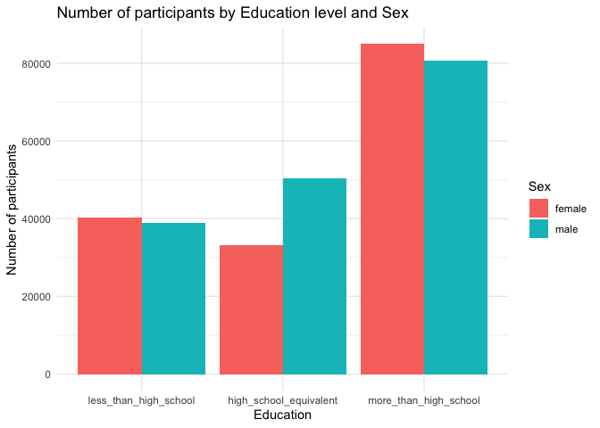

DataScience_HW3
================
2024-10-10

## Problem 1

Size of dataset before data cleaning: 7 variables (columns) and 2595176
observations (rows).

Variable names include: id, date, prcp, snow, snwd, tmax, tmin.

There is a significant amount of missing data

``` r
filter(ny_noaa, (is.na(snow) | snow == "") &
         (is.na(tmin) | tmin == "") &
         (is.na(tmax) | tmax == "") &
         (is.na(prcp) | prcp == "")) %>% 
  nrow()
```

    ## [1] 73950

There are 73950 rows that have missing data in all four columns tmax,
tmin, prcp, and snow.

``` r
filter(ny_noaa, (is.na(tmin) | tmin == "") &
         (is.na(tmax) | tmax == "")) %>% 
  nrow()
```

    ## [1] 1132502

And 1132502 rows that have missing data for both coloumns tmax and tmin.

The missing data is an issue, as there is inconsistancy in the data /
information.

**Do some data cleaning. Create separate variables for year, month, and
day.**

``` r
dated_ny_noaa = 
  ny_noaa %>% 
  mutate(
    year = year(date),
    month = month(date),
    day = day(date)
  ) %>% 
  select(-date)
```

**Ensure observations for temperature, precipitation, and snowfall are
given in reasonable units.**

Current units –\>

- temperature in 10ths of degrees celcius (need to be converted to whole
  degrees celcius)

- precipitation in tenths of mm (to be converted to mm)

- snowfall in mm (can remain in mm or converted to cm)

``` r
dated_ny_noaa = 
  dated_ny_noaa %>% 
  mutate(tmax = as.integer(tmax), 
         tmin = as.integer(tmin)) %>% 
  mutate(tmax = tmax / 10, 
         tmin = tmin / 10, 
         prcp = prcp / 10)
```

**For snowfall, what are the most commonly observed values? Why?**

``` r
dated_ny_noaa %>% 
  filter(snow > 0) %>%
  group_by(snow) %>% 
  summarise(count = n()) %>% 
  arrange(desc(count)) %>%
  slice_head(n = 5) %>%
  pull(snow)              
```

    ## [1] 25 13 51 76  8

Most commonly observed value was 0 snowfall, followed by 25, 13, 51 and
76mm of snow fall.

This is consistent with the fact that it only snows in the coldest
months of winter in NY therefore majority of the observations will have
0 snow. It is also noted that on average, NYC sees around 29.8 inches of
snow in a season which is relatively consistent with the most commonly
observed values of snowfall in this data frame.

**Make a two-panel plot showing the average max temperature in January
and in July in each station across years. Is there any observable /
interpretable structure? Any outliers?**

``` r
avg_tmax_1 = 
dated_ny_noaa %>% 
  filter(month == 1) %>% 
  group_by(id, year, month) %>% 
  summarise(mean_value = mean(tmax, na.rm = TRUE)) %>% 
  filter(!is.na(mean_value))
```

    ## `summarise()` has grouped output by 'id', 'year'. You can override using the
    ## `.groups` argument.

``` r
avg_tmax_7 = 
dated_ny_noaa %>% 
  filter(month == 7) %>% 
  group_by(id, year, month) %>% 
  summarise(mean_value = mean(tmax, na.rm = TRUE)) %>% 
  filter(!is.na(mean_value))
```

    ## `summarise()` has grouped output by 'id', 'year'. You can override using the
    ## `.groups` argument.

``` r
tmax_1_p = 
  avg_tmax_1 %>% 
  ggplot(aes(x = year, y = mean_value, color = id)) +
  geom_point(alpha = .5) +
  labs(title = "Average Maximum Temperature of Stations in January across Years and Stations",
       x = "Year",  
       y = "Average Maximum Temperature (°C)") + 
  theme(legend.position = "none")

tmax_7_p = 
  avg_tmax_7 %>% 
  ggplot(aes(x = year, y = mean_value, color = id)) +
  geom_point(alpha = .5) +
  labs(title = "Average Maximum Temperature of Stations in July across Years and Stations",
       x = "Year",  
       y = "Average Maximum Temperature (°C)") + 
  theme(legend.position = "none")

tmax_1_p + tmax_7_p
```

<!-- -->

In general the average maximum temperatures in January are more varied
across the years and spread out within the year then those in July.

There may be a slight upward trend of the average maximum temperature in
January as the years pass, but this is only very slight and would need
to be further confirmed.

Some noticeable outliers include in the year 1981 January where there
was an extremely low temperature recording average of about -17 degrees
Celsius. Where the other stations recorded around the 2 to -7 degrees
Celsius range. Similarly in January 2005, one station recorded a low of
-14 degree Celsius where the other stations in that same time averaged
around 5 to -5 degrees Celsius.

One outlier of Average Maximum Temperature in July is 1988 where one
station averaged below 15 degrees Celsius, where other stations in that
month had average recordings around 25 to 30 degrees Celsius.

**Make a two-panel plot showing (i) tmax vs tmin for the full dataset
(note that a scatterplot may not be the best option);**

**(ii) make a plot showing the distribution of snowfall values greater
than 0 and less than 100 separately by year.**

## Problem 2

**Load, tidy, merge, and otherwise organize the data sets. Your final
dataset should include all originally observed variables; exclude
participants less than 21 years of age, and those with missing
demographic data; and encode data with reasonable variable classes
(i.e. not numeric, and using factors with the ordering of tables and
plots in mind).**

``` r
demographic_df = 
  read_csv(file = "data/nhanes_covar.csv", 
           na = c("NA", ",", ".")) %>% 
  janitor::clean_names()
```

    ## New names:
    ## Rows: 254 Columns: 5
    ## ── Column specification
    ## ──────────────────────────────────────────────────────── Delimiter: "," chr
    ## (5): ...1, 1 = male, ...3, ...4, 1 = Less than high school
    ## ℹ Use `spec()` to retrieve the full column specification for this data. ℹ
    ## Specify the column types or set `show_col_types = FALSE` to quiet this message.
    ## • `` -> `...1`
    ## • `` -> `...3`
    ## • `` -> `...4`

``` r
accelerometer_df = 
  read_csv(file = "data/nhanes_accel.csv", 
           na = c("NA", ",", ".")) %>% 
  janitor::clean_names()
```

    ## Rows: 250 Columns: 1441
    ## ── Column specification ────────────────────────────────────────────────────────
    ## Delimiter: ","
    ## dbl (1441): SEQN, min1, min2, min3, min4, min5, min6, min7, min8, min9, min1...
    ## 
    ## ℹ Use `spec()` to retrieve the full column specification for this data.
    ## ℹ Specify the column types or set `show_col_types = FALSE` to quiet this message.

``` r
demographic_df = 
  demographic_df %>% 
  { 
    colnames(.) <- as.character(.[4, ])
    .[-4, ]
  } %>% 
  slice(-1,-2,-3) %>% 
  mutate(
    age = as.numeric(age),
    BMI = as.numeric(BMI),
    sex = 
      case_match(
        sex, 
        "1" ~ "male", 
        "2" ~ "female"),
    sex = as.factor(sex),
    education = 
      case_match(
        education, 
        "1" ~ "less_than_high_school",
        "2" ~ "high_school_equivalent",
        "3" ~ "more_than_high_school"), 
    education = as.factor(education)
  ) %>% 
  filter(age > 20) %>% 
  drop_na() %>% 
  rename(seqn = SEQN)
```

``` r
accelerometer_df =
  accelerometer_df %>%
  pivot_longer(
    cols = starts_with("min"),
    names_to = "minute", 
    names_prefix = "min",
    values_to = "MIMS_values" 
  ) %>% 
  mutate(
    seqn = as.character(seqn)
  )
```

``` r
Demo_Acc_Join_df =
  left_join(demographic_df, accelerometer_df, by = "seqn")
```

**Produce a reader-friendly table for the number of men and women in
each education category, and create a visualization of the age
distributions for men and women in each education category. Comment on
these items.**

``` r
Sex_Edu_df =
  Demo_Acc_Join_df %>% 
  group_by(education, sex) %>%
  summarise(count = n(), .groups = 'drop') %>%
  pivot_wider(
    names_from = sex, 
    values_from = count)
  
print(Sex_Edu_df)
```

    ## # A tibble: 3 × 3
    ##   education              female  male
    ##   <fct>                   <int> <int>
    ## 1 high_school_equivalent  33120 50400
    ## 2 less_than_high_school   40320 38880
    ## 3 more_than_high_school   84960 80640

``` r
Sex_Edu_df %>% 
  pivot_longer(
    cols = female:male, 
    names_to = "sex", 
    values_to = "count") %>% 
  mutate(
    education = factor(education, levels = c("less_than_high_school", "high_school_equivalent", "more_than_high_school"))
  ) %>% 
  ggplot(aes(x = education, y = count, fill = sex)) + 
  geom_bar(stat = "identity", position = "dodge") +
  labs(title = "Number of participants based on Education level by Sex",
       x = "Education",
       y = "Number of participants",
       fill = "Sex") +
  theme_minimal()
```

<!-- -->

``` r
Demo_Acc_Join_df %>% 
  group_by(education, sex) %>% 
  ggplot(aes(x = education, y = age)) +
  geom_violin(aes(fill = sex)) 
```

<!-- -->

``` r
Demo_Acc_Join_df %>% 
  group_by(education, sex) %>% 
  ggplot(aes(x = education, y = age, fill = sex)) +
  geom_boxplot()
```

<!-- -->
